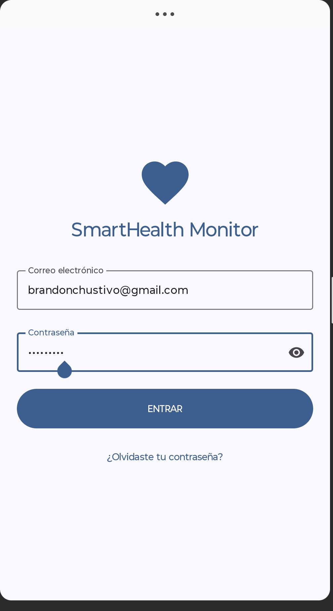
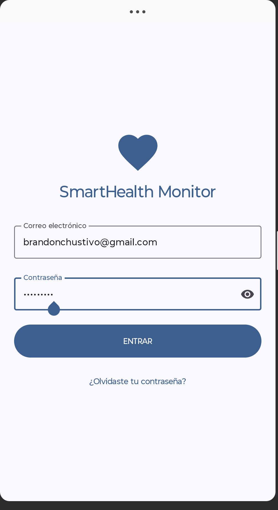

# SmartHealth Monitor

Aplicación Android multiplataforma para monitoreo de salud personal.
Desarrollada como proyecto integrador en UTNG — 9° Cuatrimestre 2025.

## Stack tecnológico
- **Lenguaje:** Kotlin
- **UI:** Jetpack Compose + Material Design 3
- **Arquitectura:** Jetpack Navigation + Room + StateFlow
- **Integraciones:**
    - Wearable Data Layer API (Wear OS)
    - Android TV / Leanback + Media3

## Pantallas implementadas
- [x] LoginScreen — S4
- [x] DashboardScreen — S5
- [ ] Historial + wearable real — S6
- [ ] Android TV — S10-S12

## Capturas de pantalla

### Login

### Dashboard

## Autor
Brandon Gustavo Mendoza Amaro — UTNG — brandonchustivo@gmail.com